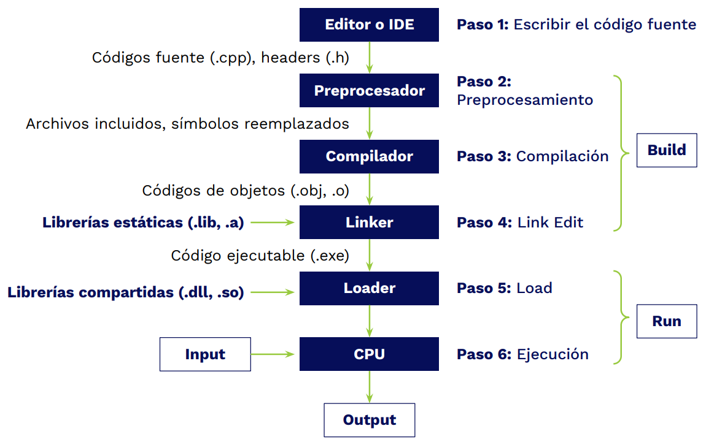

# Introducción

## Historia de C++

### 60's - 70's

Desarrollado por **Dennis Ritchie** y su equipo de investigaroes en los laboratorios Bell de la AT&T Corporation mientras desarrollaban Unix. Empezando con el lenguaje C, no había ni siquiera monitores, si no, papel y tinta. Además se hacía uso de un teclado especial.

Aún así la introduccion al concepto de entrada y salida de datos se dio.

### 80's

Más tarde **Bjarne Stroustrup**, agrego la capacidad de soportar el paradigma Orientado a Objetos permitiendo mayor nivel de abstracción. Pasaron algunos años para llamarlo C++, habían pasado 10 años desde la creación de C. Ahora existia la idea de un Sistema Operativo y desarrollar aplicaciones sobre el mismo sin necesitadad de entender el funcionamiento de la computadora a nivel hardware.

## El proceso de compilación

C y C++ son lenguajes compilados, requieren de un programa compilador que convierta el programa escrito en código fuente en un archivo ejecutable. El proceso es el siguiente:

1. **Escribir el código fuente.** Se escribe el cófigo en el Editor de Código o Entorno de Desarrollo de preferencia. Generando archivos de código fuente que pueden tener extensión .cpp (código fuente) o .h (header)

2. **Preprocesamiento.** Se ejecuta un programa llamado "Preprocesador" que se encarga de tomar los distintos archivos de código fuente que escribiste para juntarlos en archivos para pasos posteriores.

3. **Compilación.** Es dónde se hace la mayor parte de la "magia", toma el programa escrito y lo convierte en un **código objeto** (.obj, .o) que esta mucho mas cercano a lo que necesita la computadora para interpretar.

4. **Link Edit.** Junta el código fuente convetido en código objeto con las dependencías indicadas durante la creación del código fuente.

5. **Load.** Carga, realizada por el Loader, programa que arranca la ejecución del código en C++ e importa todas aquellas librerias (que se hayan indicado) que pueden ser obtenidas de forma dinamica (que no necesitan incluirse dentro del ejecutable del programa, porque ya podrían encontrarse en el Sistema operativo destino).

6. **Ejecución.** El programa se monta en la memoria, y ejecuta sus instrucciones en el CPU, dónde puede recibir sus datos de entrada y dar datos de salida.

En el siguiente diagrama se observa mejor el proceso descrito:



## Instalación en Windows

> 📝 **Nota:** Sitio recomendado si no se tiene el compilador a la mano: [OnlineGBD - Compilador online de C/C++](https://www.onlinegdb.com/online_c++_compiler)

Como ya se dijo anteriormente, el compilador es el encargado de convertir el código fuente a ejecutable. Windows no tiene uno instalado, por lo que hay que proceder a instalarle uno.

El compilador se llama **g++**, para pder instalarlo hay que descargar **MinGW**, que es un "pequeño administrador que nos permite instalar el compilador de varios lenduajes ([Descarga MinGW](https://sourceforge.net/projects/mingw-w64/files/Toolchains%20targetting%20Win32/Personal%20Builds/mingw-builds/installer/mingw-w64-install.exe/download)). Descargalo y sigue el siguiente proceso:

1. Al descargar y ejecutar, dar en la opción `Install`.
2. Se recomienta que se instale en la carpeta por default (C:\MinGW) y dar a `Continue`.
3. Espera a que termien la descarga y dale a `Continue`.
4. Se abrirá un administrador que permite instalar compiladores de distintos lenguajes. Da en la opción `mingw32-gcc-g++`. Luego en el menú dar click en `Mark for Installation`.
5. Una vez seleleccionado ir a la pestaña `Installation` en la esquina superior izquierda y seleccionar la opción `Apply Cahnges`.
6. Se abrirá una ventana, se debe dar en `Apply` para que el administrador comience la descarga e intalación del compilador.

> 📝 **Nota:** en el apartado de *Description* debe decir **"The GNU C++ Compiler"**.

### Agregando a PATH

Para correr los programas escritos en C++ se necesita que el compilador esté agregado en la variable de entorno **PATH** de Windows.

PATH es una variable que contiene una lista de rutas que apuntan a diferentes carpetas donde se encuentran programas importantes, que mediante comandos se pueden acceder por medio de una consola de comandos. Aquí se agregará el compilador.

1. Buscar "Variables de entorno" y dar click en la primera opción.
2. Al abrirse la ventana seleccionar el botón `Variables de entorno...`.
3. Se abre una ventana, debes buscar la Variable Path, seleccionarla y darle a `Editar`.
4. En la ventana que se abre seleccionar `Nuevo` y escribimos la ruta **"C:\MinGW\bin"**. Que es la ruta donde se instala por default.
5. Una vez listo dar en `Aceptar`.
6. Verificar que se haya aplicado llendo a una consola de comandos y escribir el comando `g++ --version`. Si no funciona reiniciar la computadora sería un buen inicio en la busqueda de una solución ya que a veces los cambios a la variable PATH suelen tomar efecto luego de un reinicio.

## Instalación en Linux

Normalmente viene instalado por default en todos los sistemas Linux. Consultar con el comando `gcc -v`. En caso de que no este instaldo, usar el siguiente comando (Ubuntu):

```bash
sudo apt-get install build-essential
sudo apt-get install g++
```

## Extensiónes para Visual Studio Code

Para tener nuestro entorno de desarrollo completamente listo, solo debemos instalar dos extensiones para nuestro editor Visual Studio Code.

### C/C++

Esta extensión nos otorgará muchas utilidades para poder programar en C++ como reconocimiento de sintaxis y alerta de errores.

### C/C++ Compile Run

Con esta extensión podremos compilar y ejecutar nuestros programas de C++ con tan solo presionar la tecla F6.

> 💡 [Buenas Notas](https://towering-lancer-935.notion.site/Curso-de-C-B-sico-5e88477de7c842c88f0f0103931a2e2e)
